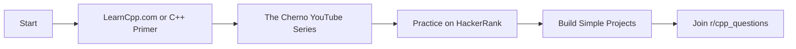
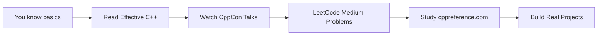
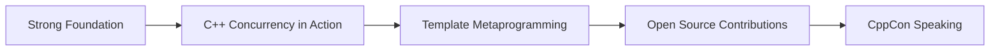

<div align="center">

# 🚀 Awesome C++ Learning Resources

### A curated collection of the best resources to master C++ programming

[](https://awesome.re)
[](https://opensource.org/licenses/MIT)
[](http://makeapullrequest.com)

[Getting Started](#-getting-started) •
[YouTube](#-youtube-channels) •
[Courses](#-online-course-platforms) •
[Books](#-books) •
[Practice](#-practice--problem-solving) •
[Community](#-communities--forums)

</div>

---

## 📚 Table of Contents

- [🎯 Getting Started](#-getting-started)
- [🎥 YouTube Channels](#-youtube-channels)
- [🎓 Online Course Platforms](#-online-course-platforms)
- [📖 Books](#-books)
- [💻 Interactive Learning Platforms](#-interactive-learning-platforms)
- [📋 Documentation & References](#-documentation--references)
- [🏆 Practice & Problem Solving](#-practice--problem-solving)
- [👥 Communities & Forums](#-communities--forums)
- [📝 Blogs & Articles](#-blogs--articles)
- [🛠️ Tools & Compilers](#️-tools--compilers)
- [🎯 Learning Paths](#-learning-paths)
- [💡 Pro Tips](#-pro-tips)
- [🤝 Contributing](#-contributing)

---

## 🎯 Getting Started

> **New to C++?** Start here! C++ is a powerful, high-performance programming language used in game development, systems programming, embedded systems, and much more.

### What You'll Need
- A computer (Windows, Mac, or Linux)
- A text editor or IDE
- A C++ compiler (GCC, Clang, or MSVC)
- Patience and practice!

### Quick Start Resources
1. 📺 [The Cherno's C++ Series](https://www.youtube.com/c/TheChernoProject) - Start here for video learners
2. 📖 [LearnCpp.com](https://www.learncpp.com/) - Start here for text learners
3. 💻 [Compiler Explorer](https://godbolt.org/) - Write and test code immediately

---

---

## 🎥 YouTube Channels

### 🟢 Beginner to Intermediate

| Channel | Description | Best For |
|---------|-------------|----------|
| [**The Cherno**](https://www.youtube.com/c/TheChernoProject) | Most popular C++ channel with extensive series covering fundamentals to advanced topics | Game dev & practical applications |
| [**CodeBeauty**](https://www.youtube.com/c/CodeBeauty) | Beginner-friendly tutorials with clear explanations | Complete beginners |
| [**Programming with Mosh**](https://www.youtube.com/c/programmingwithmosh) | Comprehensive tutorials with excellent production quality | Structured learning |
| [**Caleb Curry**](https://www.youtube.com/c/CalebTheVideoMaker2) | Complete C++ programming course with detailed explanations | Step-by-step learners |

### 🔴 Advanced & Specialized

| Channel | Description | Best For |
|---------|-------------|----------|
| [**CppCon**](https://www.youtube.com/user/CppCon) | Official C++ Conference channel with talks from industry experts | Modern C++ features & best practices |
| [**Jason Turner (C++ Weekly)**](https://www.youtube.com/c/JasonTurner-lefticus) | Weekly short videos on C++ tips and tricks | Quick learning & staying current |
| [**Back to Back SWE**](https://www.youtube.com/c/BackToBackSWE) | Algorithms and data structures focus | Interview preparation |
| [**javidx9**](https://www.youtube.com/c/javidx9) | Game development and creative coding projects | Fun, project-based learning |

---

## 🎓 Online Course Platforms

### Udemy

| Course | Instructor | Level | Highlights |
|--------|-----------|-------|-----------|
| **Beginning C++ Programming - From Beginner to Beyond** | Tim Buchalka | Beginner | Modern C++ (C++14/17), hands-on projects |
| **Unreal Engine C++ Developer** | GameDev.tv | Beginner-Intermediate | Game development focus, practical projects |
| **Learn Advanced C++ Programming** | John Purcell | Advanced | STL, templates, modern features |
| **C++ From Beginner to Expert** | Arkadiusz Włodarczyk | All Levels | Complete coverage with examples |

### Coursera

- 🎓 **C++ For C Programmers** (UC Santa Cruz) - For experienced programmers
- 🎓 **Object-Oriented Data Structures in C++** (UIUC) - OOP and data structures focus
- 🎓 **C++ Programming for Unreal Game Development** (U of Colorado) - Specialization

### Other Platforms

- **Pluralsight**: C++ Fundamentals by Kate Gregory, Beautiful C++: STL Algorithms
- **LinkedIn Learning**: Learning C++ by Bill Weinman
- **Educative.io**: Text-based interactive C++ courses

---

## 📖 Books

### 🟢 Beginner

| Book | Author(s) | Description |
|------|-----------|-------------|
| **C++ Primer (5th Edition)** | Stanley Lippman, Josée Lajoie, Barbara Moo | The gold standard for learning C++ from scratch |
| **Programming: Principles and Practice Using C++** | Bjarne Stroustrup | By C++'s creator, focuses on fundamentals |
| **Accelerated C++** | Andrew Koenig, Barbara Moo | Fast-paced intro for experienced programmers |

### 🟡 Intermediate to Advanced

| Book | Author | Focus Area |
|------|--------|-----------|
| **Effective C++ (3rd Edition)** | Scott Meyers | 55 ways to improve your code |
| **Effective Modern C++** | Scott Meyers | C++11/14 features and best practices |
| **The C++ Programming Language (4th Edition)** | Bjarne Stroustrup | Comprehensive reference by C++'s creator |
| **C++ Concurrency in Action (2nd Edition)** | Anthony Williams | Multithreading and concurrent programming |
| **Modern C++ Design** | Andrei Alexandrescu | Advanced template programming |

> 💡 **Pro Tip**: Start with one beginner book, then move to "Effective C++" series for best practices.

---

## 💻 Interactive Learning Platforms

| Platform | Type | Best For |
|----------|------|----------|
| [**LearnCpp.com**](https://www.learncpp.com/) | Free tutorials | Comprehensive, regularly updated content |
| [**Codecademy**](https://www.codecademy.com/learn/learn-c-plus-plus) | Interactive browser | Hands-on coding in browser |
| [**SoloLearn**](https://www.sololearn.com/Course/CPlusPlus/) | Mobile app | Learning on-the-go |
| [**Educative.io**](https://www.educative.io/) | Text-based courses | In-browser coding environments |
| [**Codewars**](https://www.codewars.com/) | Coding challenges | Practice through kata exercises |

---

## 📋 Documentation & References

> 🔖 **Bookmark These!** Essential references every C++ developer needs.

- [**cppreference.com**](https://en.cppreference.com/) - 🌟 The most comprehensive C++ reference
- [**cplusplus.com**](https://cplusplus.com/) - Tutorial and reference documentation
- [**ISO C++ Website**](https://isocpp.org/) - Official news and articles about C++ standard
- [**Microsoft C++ Docs**](https://docs.microsoft.com/en-us/cpp/) - Excellent Visual C++ documentation
- [**C++ Core Guidelines**](https://github.com/isocpp/CppCoreGuidelines) - Modern best practices (GitHub)

---

## 🏆 Practice & Problem Solving

### Coding Challenge Platforms

| Platform | Difficulty | Best For |
|----------|-----------|----------|
| [**LeetCode**](https://leetcode.com/) | Easy-Hard | Interview prep, algorithms |
| [**HackerRank**](https://www.hackerrank.com/domains/cpp) | Easy-Advanced | Dedicated C++ track |
| [**Codeforces**](https://codeforces.com/) | Beginner-Expert | Competitive programming |
| [**AtCoder**](https://atcoder.jp/) | Beginner-Advanced | High-quality problems |
| [**Project Euler**](https://projecteuler.net/) | Varies | Mathematical problems |
| [**Exercism**](https://exercism.org/tracks/cpp) | Easy-Medium | Mentor feedback, community |

> 🎯 **Recommendation**: Start with HackerRank's C++ track, then move to LeetCode for interview prep.

---

## 👥 Communities & Forums

### Where to Get Help

| Community | Platform | Focus |
|-----------|----------|-------|
| [**r/cpp**](https://www.reddit.com/r/cpp/) | Reddit | News, discussions, best practices |
| [**r/cpp_questions**](https://www.reddit.com/r/cpp_questions/) | Reddit | Q&A for learners |
| [**Stack Overflow**](https://stackoverflow.com/questions/tagged/c%2b%2b) | Q&A Site | Problem-solving, debugging |
| **cpplang.slack.com** | Slack | Real-time chat with developers |
| **Together C & C++** | Discord | Active learning community |

> 💬 **Don't be shy!** The C++ community is generally welcoming to beginners. Ask questions!

---

## 📝 Blogs & Articles

| Blog | Author/Focus | Topics |
|------|-------------|--------|
| [**Fluent C++**](https://www.fluentcpp.com/) | Expressive code | Modern practices, clean code |
| [**Modernes C++**](https://www.modernescpp.com/) | Rainer Grimm | Modern C++, concurrency |
| [**Sutter's Mill**](https://herbsutter.com/) | Herb Sutter | Standards committee insights |
| [**Simplify C++!**](https://arne-mertz.de/) | Arne Mertz | Clean, maintainable code |
| [**foonathan::blog()**](https://www.foonathan.net/) | Jonathan Müller | Advanced techniques, libraries |

---

## 🛠️ Tools & Compilers

### Online Compilers (No Installation Needed!)

| Tool | Best For |
|------|----------|
| [**Compiler Explorer (Godbolt)**](https://godbolt.org/) | Viewing assembly output, comparing compilers |
| [**Wandbox**](https://wandbox.org/) | Quick testing, multiple compiler versions |
| [**OnlineGDB**](https://www.onlinegdb.com/online_c++_compiler) | Debugging online |

### IDEs & Editors

#### Full IDEs
- **Visual Studio** (Windows) - Industry-standard, powerful debugging
- **CLion** (JetBrains) - Cross-platform, intelligent code analysis
- **Code::Blocks** - Free, lightweight, cross-platform
- **Qt Creator** - Excellent for Qt and general C++ development

#### Lightweight Editors
- **Visual Studio Code** - Free, extensible, cross-platform (install C++ extension)
- **Sublime Text** - Fast, customizable
- **Vim/Neovim** - For keyboard enthusiasts

### Compilers

```bash
# Linux/Mac
gcc/g++          # GNU Compiler Collection
clang++          # LLVM Clang compiler

# Windows
MSVC             # Microsoft Visual C++
MinGW            # GCC port for Windows
```

---

---

## 🎯 Learning Paths

### 🟢 Complete Beginner Path



**Timeline**: 3-6 months  
**Daily Commitment**: 1-2 hours

**Week 1-4**: Basic syntax, variables, control flow  
**Week 5-8**: Functions, arrays, pointers  
**Week 9-12**: OOP concepts, classes  
**Week 13-24**: STL, file I/O, projects

### 🟡 Intermediate Path



**Timeline**: 6-12 months  
**Focus**: Modern C++ features, best practices, real-world applications

1. Master "Effective C++" and "Effective Modern C++"
2. Deep dive into STL algorithms and containers
3. Learn CMake and build systems
4. Contribute to small open-source projects
5. Solve 100+ LeetCode problems

### 🔴 Advanced Path



**Timeline**: Ongoing  
**Focus**: Mastery, specialization, teaching others

1. Master multithreading and concurrent programming
2. Study template metaprogramming and compile-time programming
3. Contribute to major open-source projects
4. Attend/speak at C++ conferences
5. Specialize: game dev, systems programming, embedded, HPC, etc.

---

## 💡 Pro Tips

### ⚡ Accelerate Your Learning

- ✅ **Code Every Day** - Even 30 minutes beats 3 hours once a week
- ✅ **Read Others' Code** - Study open-source projects on GitHub
- ✅ **Build Projects** - Theory without practice is useless
- ✅ **Use Debuggers** - Don't just use `cout`, learn proper debugging
- ✅ **Teach Others** - Best way to solidify your knowledge

### ❌ Common Mistakes to Avoid

- ❌ Skipping the basics to jump to "cool" topics
- ❌ Not learning modern C++ (C++11 and beyond)
- ❌ Only watching tutorials without coding
- ❌ Giving up when facing memory management
- ❌ Not asking for help when stuck

### 🎯 C++ Standards Evolution

```
C++98  → Legacy (avoid)
C++03  → Legacy (avoid)
C++11  → Modern C++ begins! ✅ START HERE
C++14  → Minor improvements ✅
C++17  → Major features ✅
C++20  → Huge update (modules, concepts) ✅
C++23  → Latest standard ✅
```

> 💡 **Focus on C++11 and beyond.** Modern C++ is safer, cleaner, and more expressive.

---

## 📌 Additional Resources

- [**Awesome C++**](https://github.com/fffaraz/awesome-cpp) - Curated frameworks, libraries, and tools
- **C++ Weekly Newsletter** - Stay updated with weekly C++ content
- [**Meeting C++**](https://meetingcpp.com/) - Conference and community resources
- [**C++ Slack Community**](https://cpplang.slack.com) - Real-time discussions

---

## 🤝 Contributing

Found a great resource we missed? Want to improve this guide?

1. Fork this repository
2. Add your resource (keep the format consistent)
3. Submit a pull request
4. Help others learn C++!

**Contribution Guidelines**:
- Resources must be high-quality and actively maintained
- Include a brief description of what makes the resource valuable
- Categorize appropriately
- Check for duplicates before adding

---

## 📜 License

This repository is licensed under the MIT License - feel free to share and adapt!

---

## ⭐ Support

If you found this guide helpful:
- ⭐ Star this repository
- 🔗 Share it with fellow C++ learners
- 🐛 Report issues or broken links
- 💬 Suggest improvements

---

<div align="center">

**Happy Coding! 🚀**

Made with ❤️ by the C++ Community

*Last Updated: December 2024*

[⬆ Back to Top](#-awesome-c-learning-resources)

</div>